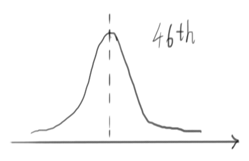
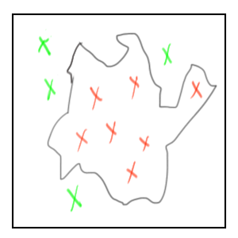

# 数据往事

本文的作者是**深深爱着人类**的「我」。

论通信工程研究生如何在学习中生硬地使用大数据……

我建立了个人网站「momo9.me」，大家多去我那看看吧。点击「阅读原文」可以访问哈~

---

自从上班以后，更新的频率低得可怜，这状态始终没有调整过来。今年的教师节是离开校园后的第一个教师节，写一个当年我们用统计数据来预测老师行为的故事。

## 巴巴罗萨计划

在国内读 IT 类专业的硕士和工作差别不大。实验室其实就是办公室，一个学生有一台电脑就可以从事科研活动了。有些老师管理得宽松一些，采用柔性工作制，或是对出勤没有任何要求；有些老师的管理则非常严格，上下班打卡、刷指纹都是正常现象。

我们的老师，就属于后者。除了要求上下班刷指纹之外，老师还喜欢搞突击检查，不定时突袭实验室，看看我们有没有缺勤或者做工作以外的事情。这种突袭，对我们的心脏造成了不小的考验。

那是 2013 年，「大数据」的概念刚被炒得火热。随着这股热潮，我们也搞了个「巴巴罗萨计划」，试图通过老师访问实验室的数据统计来预测他访问实验室的行为。计划的终极目标，是能够在老师突袭实验室前的一两分钟发出预警，让大家能事先做好准备。

## 不确定性

这个世界真的是可预测的么？答案是肯定的。

一个比较成功的例子是「天气预报」。尽管经常有听到别人吐槽天气预报一点也不准，但其实现代天气预报经过几十年的发展，已经相当的科学。

我们日常中接触的各种事物更接近于「线性系统」，输入的微小变化对于输出的影响也是微弱的。而天气系统是一个「混沌系统」，在这种系统中，输入的微小变化会引起输出的巨大变化，产生「蝴蝶挥动一下翅膀造成风暴」的效果。混沌系统非常复杂，模拟一个混沌系统需要大量的计算。不过，对于天气系统的建模已经相当成功，而大量的计算则因为如今计算机卓越的计算能力而不再成为一个问题，所以如今的天气预报是相当准确的。为什么天气预报得出的是「明日下雨概率为80%」这样的结论？其实天气预报在进行模拟的时候，会对输入的条件进行数量繁多的微调，因为混沌系统的原因，每种微调得出的结果都会不太一样，有些是晴天，有些是下雨，因此天气预测的结果，是有概率的，而并不是确定的。

还有一个例子，是「地震预测」。看到这里，你一定觉得我在骗人，地震怎么可以预测呢？这里说的预测，和大家想象的预测不太一样，不是预测明天会不会发生地震的那种预测（那是算命……），而是能够预测「某地发生某种级别地震的概率是多少」。这种预测，看起来并没有多大的作用，就好像我们都知道掷硬币正反面的概率各为50%，但这只是一个在掷过很多次硬币之后才会得到的一个统计结论，就算我们知道结论就是这样，却永远无法知道下一次掷硬币的结果到底是什么。

然而这才是预测的本质：这世界充满了不确定性，即使是准确的预测，也只能得出事件发生的一个概率，并保证如果我们尝试很多次，从统计上来说，这个概率是正确的。然而未来只有一个，不管概率是大是小，发生就是发生，没发生就是没有发生。

我们平常的科研工作也和概率息息相关：我们是研究让信号传播更为可靠的技术的。因为信号传播的环境也相当的随机，所以与预测类似，我们的技术也没法保证传输的每个信号都更为可靠，只能保证有很大的概率使得信号的传播更可靠，或者说，保证传播很多信号的时候，我们的技术在「统计上」使得信号的传播更为可靠。

那么我们如何验证我们研究成果的性能呢？我们使用「蒙特卡洛」法。蒙特卡洛是地中海沿岸的赌城，充满了神秘的色彩。但蒙特卡洛法本身是个很简单直接的办法，这个方法的原理是，当难以通过分析来得到结果的时候，那就随机的试，当试的样本很大很大的时候，我们就认为试出来的统计结果就是真正的结果。

蒙特卡洛法的一个经典应用是算地图的面积。当地图形状很奇怪的时候，进行数学计算是很困难的，这时候，我们把地图放在一个已知面积的规则形状里，然后在这个已知形状中随机地生成点。当点很多很多的时候，我们就认为「位于地图中点的数目（红色）和生成点的总数（红色+绿色）的比值」与「地图面积和外面形状面积的比值」是一致的，并据此求出地图的面积。对于我们的研究来说，就是传输大量的信号，并认为传输大量信号时得到的性能就是我们研究的技术的实际性能。

## 真相还是巧合

扯得有点远。数据统计很快就开始了，经过一段时间的记录，我们首先发现了一条明显的规律：老师每周三的上午是不出现的。那么，这样的统计数据能不能让我们做出「老师周三上午一定不会出现」的预测呢？

答案是否定的。因为这世上存在一种叫做「巧合」的东西，也正因为巧合的存在，纯粹依赖于统计的预测方法弄不好就会失手。可是，所谓的巧合不就应该是概率很小的事情么？为什么还要把它带来的误差考虑在内呢？其实，这就像是买彩票：每个人中奖的概率确实都很小，但是却总有人会中奖。预测的敌人，并不是某一个概率很小的特定巧合，而是所有可能发生的巧合，这合起来的概率，可不是一个小数。加上我们的数据样本又比较小，碰上巧合的可能性确实不小。

因此，除了统计之外，我们还需要「分析」。通过分析，找到统计现象后的真正原因，才能避免统计现象本身其实只是一个巧合。通过统计的方法发现现象，假定一个结果，再尝试通过结果反推原因，看到本质，把统计的方法和预测的方法结合起来，这算是预测的基本方法论吧。

不久，我们打听到师母每周三上午要上课，因此老师周三上午要在家照顾小孩，「老师周三上午不会出现在实验室」才真的成为了一个结论。