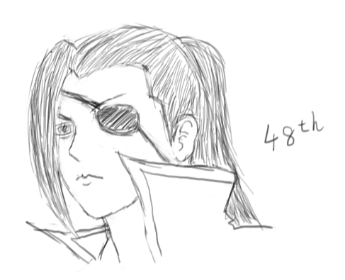

# 「刻奇」摸摸是怎么来的

本文的作者是**深深爱着人类**的「我」。

看了魔兽世界电影的预告片, 想起了一些往事

我建立了个人网站「momo9.me」，大家多去我那看看吧。点击「阅读原文」可以访问哈~

---

等了这么多年，魔兽世界的电影终于是要来了。魔兽系列的游戏，对我们这代人有着非同寻常的意义。我也是老玩家了，上初中的时候打 War 3，60 年代（就是最高级别还只有 60 级的时候）开始玩 WOW，关于魔兽，留下的回忆不少。

印象比较深的，有这么几件事情。

一件是初中秋游的时候，返程时班车座位不够，一部分人只能走回去。本来想和当时喜欢的姑娘一起走回去，但是没坚持住，被一群基友拉到车上，到网吧打 War 3 去了。结果，一个下午心绪不宁，后悔没有和姑娘一起走回家，输的很惨。

另一件是高一的时候，跟一位 T 同学关系甚好，每天放学一起去网吧玩一个小时 WOW 再回家。到高二的时候，喜欢上了一个姑娘，每天放学改成和姑娘一起回家，跟 T 同学的联系就少了。如今，已经几年都没有说过话了吧。

再就是今天的主角 mo 君了。忘了原因，高一那年的暑假，我没有和基友们一起练级，却自己换服务器练起了小号。我遇到了一个名字里带 mo 的人，一见如故，一起练级度过了整个夏天。夏天结束的时候，我不小心弄丢了账号，等我找回账号之后，便再也没有见过 mo 君上线。找不到他，我在这个服务器呆着也觉得没有意思，重新捡起大号和基友们一起玩去了。从此，我们失去了联系。

没有更多的故事了，因为过去太久，我都忘了。

我发过站内信，去公会找人问过，可凭良心讲，确实没有非常努力地去找过他。那时候，生活和网络的联系还没有这么紧密吧。要学习，要恋爱，却不一定要上网。日子就那么一天一天地度过，通常也不会想起他来，只是打游戏的时候，就会不由自主地想起来，在这虚拟的网络之中，隐藏着我的一位失去了联系的好友。

也许有一天，我们会再次擦肩而过，却因为账号的更换，而互不相识。虚拟的关系，如此的脆弱。面对这些，我能做什么呢？我只好把他的名字作为自己的名字，算作相识一场的证据，算作来日相认的凭证，自我安慰。

可是，快十年过去了，相认还有什么意义。

再回到那一年秋游的地点，再让我和当年喜欢的姑娘一起走回来，时过境迁的我们，该说什么呢？

再和 T 同学说说话是最简单的任务了，可我们早已不再是当年那么好的朋友，对话也只是寒暄吧。

就算找到了 mo 君，已经忘记了我们的共同回忆的我，能和他说什么呢？

「我去泰山玩几天，这几天不上了。」

「好，我也要开学了，以后上线不会那么频繁了。」

这是我唯一记得的，我和 mo 君最后的对话。

(至于 momo9 的 9, 则来自题图这位柳生公子)