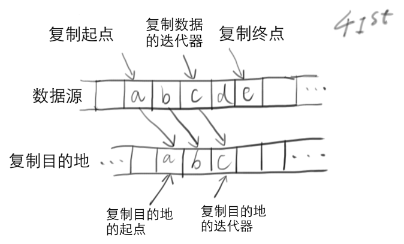

# 【STL】一些算法：复制

本文的作者是**深深爱着人类**的【我】。

这篇文章说说 C++ 标准模板库 STL 中实现的一些经典算法。

我建立了个人网站【momo9.me】，大家多去我那看看吧。点击『阅读原文』可以访问哈~

-----

> 《STL 源码剖析》 侯捷

在三个月之前写的 introduction 篇里面，我是这么说的：

> *容器*是用于存储数据的数据结构，*算法*则是操作容器中数据的一些常用操作。

而且，这些算法对于各种容器是**通用**的：

> STL 中有形形色色的容器，那么算法是怎样做到通用的呢？答案是凭借*迭代器*。迭代器是用于遍历容器的对象。在算法中，仅通过迭代器来遍历容器，实现功能，而不直接访问容器。因此，只要容器提供了合适的迭代器，算法就可以对其进行处理，而不需要了解容器的具体实现是怎样的。

在这篇文章之前，我写了 vector & deque 篇和 map & hash_map 篇，介绍了 STL 中常见的几种容器。现在，容器介绍完了，让我们来谈谈算法。

老实说，因为其通用性，STL 中的算法和我们想象中原理深奥的算法并不是一类东西，更多的只是对容器的一些基本操作，比如复制、逆序等，功能上比较 low。不过，即使在通用的情况下，STL 中一些算法的设计仍然挺巧妙的，这里选择其中四种（复制、排序、旋转、合并）进行介绍。

## 复制

首先我们来讲讲*复制算法*，最直接的复制算法：假设你有 n 个数据要复制，就把 n 个数据一个一个复制过去的那种算法，而不是什么能够在*O(lgn)*时间甚至*O(1)*时间内完成相同任务的神奇算法（这种算法应该也不存在吧……）。

既然这么直接，那还有什么可介绍的呢？通过迭代器对这 n 个数据进行遍历，并复制到目的地不就好了吗？

是的，从算法的过程上来说是这样没错，非常简单。但这里我们想要介绍的是，STL 的复制算法如何根据不同容器的迭代器的特点，将复制的性能提升到极致。

### 通用复制算法

最通用的迭代器要具备以下三个功能：

* 判断本身与另一个迭代器是否相等：这样才知道什么时候应该停止迭代
* 取迭代器当前位置的数据：这样才能访问数据
* 访问下一个位置：这样才能遍历整个容器

与之对应，针对通用迭代器实现的通用复制算法应该做下面这三件事情：

* 判断复制数据的迭代器是否已经与复制终点处的迭代器相等，如果相等，说明复制已经完成，停止复制
* 调用赋值运算符进行复制
* 将复制数据的迭代器与复制目的地处的迭代器分别向后移动一个位置

正如之前所述，容器提供了迭代器作为接口，具有一些通用的功能。算法仅对迭代器的通用功能进行操作，而不必关注容器具体是什么，具有很好的通用性。

不过我们可以看到，上述的通用复制算法涉及迭代器是否相等的判断、对赋值运算符的调用、迭代器的移动等操作，虽然通用性好，但是效率不佳。

要想提高效率，在通用迭代器的层面上难有突破，还是得从各种迭代器的特性上入手。接下来让我们看看 STL 的复制算法具体是怎么做的。

### char 型指针，区别对待

指针也是迭代器，是*数组*这种容器的迭代器。对于 `char` 型数组来说，使用通用的复制算法是非常浪费的，赋值运算符的调用与迭代器的比较是完全没有必要的开销。

因此，STL 对迭代器为 `char` 型指针的情况重载了一个特殊的版本复制算法，直接调用底层的 `memmove()` 函数进行复制。

### 随机访问迭代器，区别对待

虽然迭代器是容器的通用接口，但不同的迭代器也有不同的特性。比如：

* vector 内的内存是连续的，因此其迭代器支持随机访问，可以在*O(1)*时间内求出两个迭代器之间的距离
* list 内的内存不连续，因此其迭代器不支持随机访问，如果要求出两个迭代器之间的距离，必须一个一个迭代器地从迭代器 A 移动到迭代器 B，时间复杂度为*O(n)*

在复制的时候，对于支持随机访问的迭代器，没必要一个一个迭代器地判断是否已经到达复制的终点，效率太低。更高效的做法是计算出终点与起点之间的距离，进行计数即可。为此，STL 为支持随机访问的迭代器重载了一个特殊版本的复制算法。

而对于不支持随机访问的迭代器，则没有其它办法，只能采用通用的复制算法。

### 具有 trivial 赋值运算符的类，区别对待

复制算法的另一个开销是对赋值运算符的调用。在 C++ 中，我们可以重载运算符，因此对于不同的类，赋值运算符可能具有不同的意义：

* 有的赋值运算符就是常规的内存复制，称为 trivial 赋值运算符
* 有的赋值运算符可能完成比较复杂的操作，称为 non-trivial 赋值运算符

如果容器内的数据具有 trivial 的赋值运算符，那么调用赋值运算符函数就没有意义，只是增加了函数调用的开销而已，直接调用 `memmove()` 函数来复制就好。如果容器内的数据具有的是 non-trivial 的赋值运算符，那么没有办法，只能老老实实地使用通用的复制算法，调用赋值运算符完成复制。

这里的难点在于，C++ 没有反射的机制，如何判断一个类是否具有 trivial 的赋值运算符呢？STL 通过 traits 来达到这个目的。至于什么是 traits，这里先略过，之后会有专门的章节来介绍。

---

本文到此结束，下一篇介绍 STL 中的排序算法。