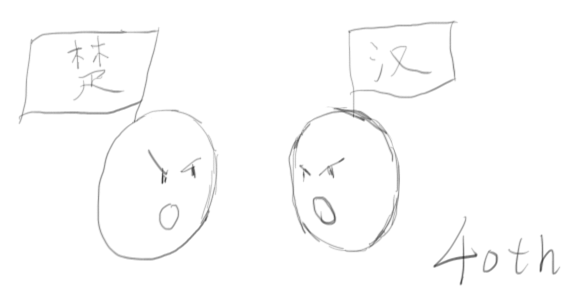

Date: 2015-04-10  
Title: 【历朝通俗演义】秦末汉初，优秀一点就赢了  
Published: true  
Type: post  
Excerpt:   

本文的作者是**深深爱着人类**的【我】。

这篇文章是《历朝通俗演义·前汉演义》的读后感，关于*秦朝与楚汉争霸*。

我建立了个人网站【momo9.me】，大家多去我那看看吧。点击『阅读原文』可以访问哈~

---

> 《历朝通俗演义·前汉演义》 蔡东藩

*STL 系列*的读后感写得我稍有点累，这次我们换换口味，说说前段时间利用在路上时间看的《历朝通俗演义》。之后，这个系列文章会和 STL 系列文章交替发布。

我觉得，大部分人还是挺喜欢历史的。尽管我们可能不会喜欢历史资料中纷繁复杂的考据，不会喜欢历史后面蕴含的政治经济背景，但对于历史上那些戏剧化的情节，都会有点兴趣。

然而野史太假，文言文且纪传体的正史又会有很大的阅读障碍，所以还原度比较高的历史小说则是一个很好的选择。所以，当年明月的《明朝那些事儿》才会那么火。

随着《明朝那些事儿》的火爆，与之相似的针对历朝历代的历史小说层出不穷，但是质量却参差不齐，其中的一些，让人不是很有读下去的欲望。不过，去年年底的时候，我发现了一套书，是民国时的蔡东藩写的《历朝通俗演义》。这套书可以说是用通俗演义的笔法，把正史的内容给重写了一遍，不仅囊括了从秦到清的全部朝代，而且风评不错，**完全满足需求**。

《历朝通俗演义·前汉演义》包括了从*吕不韦奇货可居*开始到*王莽篡汉*的历史。今天我先说说对于*秦与楚汉争霸*这段历史的一点看法：大部分人都是简单粗暴的，稍微优秀一点就非常突出了。

## 暴秦

为什么最终是秦统一天下？这里有两个很重要的秦国君主。

* **秦穆公。**秦在穆公时代就已经称霸西戎。能够称霸西戎这个我觉得是很重要的，这使得秦国有了一个非常稳定的发展环境，不像中原地带那样，战火总是在自己家里烧。正如美帝。
* **秦孝公。**孝公的时候发生了商鞅变法。变法的内容是使用严酷的法令、赏罚分明、焚书愚民一类的。变法之后，秦国的国立日益强大。

至于秦始皇（以及后来的汉武帝）的成功，我认为更主要地是建立在强大的国力的基础上，至于他们个人的“雄才大略”，我觉得并没有那么大的作用。反而，和真正能治国的君主相比，秦始皇和汉武帝有很明显的缺陷，这些缺陷导致在他们短暂的“辉煌”之后，随之到来的是混乱。

秦始皇给我的印象是*简单粗暴*与*自大*。

* 简单粗暴就是说用暴力解决一切问题。
	* 秦朝的制度太严苛了，比如两个人在一起不能说话，不允许三个人以上进行聚会。一旦犯了事，就是杀杀杀。我想如果我是当权者，大概也会因为臣民们为我的暴力所屈服，敢怒不敢言而感到愉快。**但是，这绝不是长久的，从来没有一个朝代因为暴力统治而长治久安。**
	* 不过，这就是时代的局限吧。对于秦始皇来说，暴力是让他战胜六国的方法，是让他在乱世中无往不利的方法，他可能看不到更好的方法。就像我在标题里说的：**在那个比较原始的时代，有一点比较优秀就够了。**
* 自大不用我多说，从他称自己为*始皇帝*就可以看出来。
	* 既是“皇”又是“帝”，直接秒杀一切三皇五帝。
	* 而且，自称是“始”皇帝，继任者是“二世”，然后是“三世”，子子孙孙无穷尽也……这是怎样的自大。**这么自大的人做决策的时候可想而知了，自己想到什么就是什么。**
	* 统一六国之后，秦始皇的主要工作就是各地巡游，欣赏自己的杰作，并最终死于巡游的路上。
	
如果秦始皇之后，二世如果能够修养生息，也许秦朝还能长久。可惜，秦二世不仅很好地继承了秦始皇的残暴，还在始皇的基础上变本加厉。暴秦的灭亡，是理所当然的。

如果正牌太子扶苏能够顺利上位，秦朝的命运是否会有不同？我觉得答案是否定的：*一个在北方手握重兵的太子，随便接到中央的一个命令就自杀，这样的人当皇帝有前途么？*

## 楚汉争霸

秦末的义军太多了，随便一个人都能拉起一支队伍，没有存在感的太多。**基本上，我觉得有点志气就够了。**

比如我们高呼着*王侯将相宁有种乎*的陈胜陈王，就凭借其鸿鹄之志，成为了秦末起义的第一人。而其个人能力，其实非常一般。

* **贪图富贵：**其实陈胜这个人是没有什么大志的，起兵大泽乡之后，刚拿下蕲县和陈就称王了，可见其目光狭隘
* **小聪明：**起义的时候，借助鬼神的力量，可以看出有些小聪明；但是起义打着扶苏和项燕的名号，就让人觉得有些无厘头了：一个是秦朝的废太子，一个是因为秦而亡国的楚国将领，这怎么合作？
* **多疑而残暴：**陈胜手下的部将，多因谗言而获死罪，他的部将武臣甚至因为害怕受到猜忌，直接叛变陈胜，自立为赵王
* **刻薄无信：**我们都知道当年陈胜说过“苟富贵，毋相忘”，当他富贵之后，当年的老相识们来找他的时候，他是怎么做的呢？一开始当然是好酒好肉伺候，不过当他发现这些老朋友们还把他当做陈涉来看待，而没有把他看成陈王的时候，他就把他们杀掉了……

陈胜就是这么一个有点志气，但却没什么能力的起义领袖。因此他仅仅称王六个月之后便事败身死，并不足为奇。至于其他的义军领袖，甚至还不如他，更是不值一提。

除了项羽和刘邦。

### 项羽

对于那些“站着死”的失败者，我们还是很愿意给予同情的；再加上太史公的悲情渲染，项羽成为了一个悲壮的英雄人物。

从战斗力方面来说，尽管项羽小时候不想学一人敌（剑术），也没认真学万人敌（兵法），但项羽在秦末时期还是无敌的。我感觉这个时期打战有这么个食物链：

* **普通人：**普通人打战互有胜负，没有什么规律，基本就靠人多
* **章邯：**在章邯出马以前，义军形势一片大好，直逼咸阳；章邯出现之后，起义几乎要被扑灭
* **项羽：**项羽可以碾压所有对手，包括章邯
* **韩信：**只有韩信能治项羽，不过，还不是通过正面对抗的手段

不过如果真的让项羽统一天下的话。

**那就完了吧。**

* **项羽非常残暴：**东征西讨的过程中不断地杀杀杀，攻城的时候稍有抵抗就是屠城，手段和后来的蒙古人一样；更是有坑杀二十万降卒、火烧阿房宫这样的典型事例；项羽当政，估计就是秦三世了
* **项羽不能用人：**张良、萧何、韩信、陈平……这些著名的人物都是刘邦的手下，甚至是原来在项羽那里然后转投刘邦的；而项羽的手下有谁呢？套用刘邦的话，*项羽手下只有一个范增，却还不重用*
* **项羽目光短浅：**这点和陈胜类似，灭秦之后马上分封诸侯，还自封为西楚霸王，把都城设在老家；当时有人劝项羽要把都城设在秦发迹的地方，有利于掌控天下时，项羽是这么回答的

	> 富贵不归乡，犹如在黑夜里穿着锦袍，谁会知道啊？
	
	说的好有道理的样子！我竟无言以对……

总之，项羽是个非常出色的将领，但没法成为一个好的统治者。不过，在这样的乱世里，他靠着高人一筹的武勇，也足以到达这个高度。

### 刘邦

刘邦这人真的有点流氓，“光辉”事迹很多。

* 比如，一毛钱都没有带的情况下，谎称献上一万钱的礼金，坐到别人家酒席的上座，还娶走了别人的女儿（吕雉）……
* 比如，逃难的过程中，因为嫌车慢，把儿子和女儿扔到车下，被人送回车上后再次扔下，反复几次，直到最后也还是夏侯婴抱着两个小孩逃脱的……
* 比如，就在这次逃难的过程中，虽然刘邦对于儿女是比较绝情的，但是后来被做成“人彘”的戚夫人却也是在这次逃难中勾搭上的……

刘邦的个人能力也一般：在没有韩信的情况下，他和项羽的对抗屡战屡败；汉建立以后带兵打匈奴，他也曾被围困在白登。

但是，刘邦几乎是那个时代唯一能够任用能人，并听从他们建议的人，光靠这个优点，他就足以成就汉王朝的基业了。

* 他有萧何，帮他处理种种内政事务，做好后勤保障；当萧何要他把名不见经传的韩信立为大将军的时候，他照做了
* 他有张良，运筹帷幄，谋划天下；当他差点就迷恋与咸阳的富丽堂皇时，张良劝他不要沉溺于享乐，他听从了
* 他有韩信，位于战斗力食物链顶层的无双国士
* 他有陈平，想得出各种阴谋诡计的谋士
* ……

楚汉争霸之中，看不到刘邦除了耍流氓之外的什么闪光点，只看到他麾下能人们的星光闪耀。这些人的努力合到一起，带来了汉王朝的一统。在那个年代里，刘邦是一个少有的能够把能人们汇聚到一起，任用他们，并听从他们意见的人。

所以，虽然他在其它方面是如此的平淡无奇，但是他赢了。